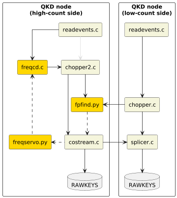

# fpfind

An add-on implementation of frequency compensation for [qcrypto](https://github.com/s-fifteen-instruments/qcrypto).

## Usage

Requirements:

* Python 3.8 and above, running in Linux
* `gcc` (if running `freqcd`, preferably in PATH for auto-compilation)

```bash
# Remote installation
pip3 install git+https://github.com/s-fifteen-instruments/fpfind.git

# Local installation
git clone https://github.com/s-fifteen-instruments/fpfind.git
cd fpfind && pip3 install .
```

Binaries and scripts will be exposed to the path; commonly used scripts are listed below.

```bash
fpfind -t {TIMESTAMPS1} -T {TIMESTAMPS2}
freqcd -X -udF fpipe -f 568 < {TIMESTAMPS}
[costream -V5 ... |] freqservo -V5 -udF fpipe -f 568
parse_timestamps -A1 -X -p {TIMESTAMPS}
```

## Motivation

Quantum key distribution requires some form of clock synchronization to retain high signal-noise ratio when pairing photon detection/generation events. This is usually achieved by having a stable clock (e.g. Rb clock, GPS receiver) or a separate clock transfer channel.

Timing correlated photons used in the QKD itself can also be used as a resource for clock synchronization, by identifying and tracking the timing delay $\tau$ using the second-order coherence $g^{(2)}(\tau)$. The timing drift in the signal indicates a frequency offset/drift between the two parties, which can be corrected with a feedback loop. This opens up the use of clock references with weaker frequency stability like quartz clocks.

This library implements the frequency compensation modules supplementing the core [qcrypto](https://github.com/s-fifteen-instruments/qcrypto) QKD software stack, and a reference usage can be found in [QKDServer](https://github.com/s-fifteen-instruments/QKDServer).

## Schematic

Components for frequency compensation (implemented in this library) are highlighted in yellow below.



In particular:

* `freqcd.c` performs frequency correction
* `fpfind.py` replaces `pfind.c` for initial frequency estimation
* `freqservo.py` performs frequency drift estimation

## Limitations

* The FFT buffer size is limited to 2**31 bins due to the implicit casting to `int32` performed internally by `np.bincount` on older versions of `numpy`. This corresponds to a buffer order value upper bounded to `q = 31` for `fpfind`. To bypass this limitation, supply an alternative implementation for `np.bincount`.

## Troubleshooting

Certain issues may appear when attempting an install on RaspbianOS:

* Importing `numpy` yields the error message stating `libopenblas.so` could not be found (this is the underlying linear algebra library for Numpy); installing the `libopenblas-dev` library fixes this, e.g. `apt install libopenblas-dev`

## Contributing

Version tags (as of **v2**) follow [semantic versioning](https://semver.org/spec/v2.0.0.html), with a build string indicating the date of release in "YYMMDD" format, e.g. **v2.0.0+2410224**. This allows clear indication to the user whether the local version is severely outdated, while maintaining the clarity of semantic versioning. Versioning is performed by:

1. Modifying the **version** field in `pyproject.toml`, with no "v"
1. Adding a basic git tag associated with the commit, with "v" prepended

Commit messages to roughly follow [Angular commit message guidelines](https://github.com/angular/angular/blob/22b96b9/CONTRIBUTING.md#-commit-message-guidelines) (which aligns with the [Conventional Commits specification](https://www.conventionalcommits.org/en/v1.0.0/)). The type should be one of the following: **feat**, **fix**, **perf**, **refactor**, **style**, **test**, **docs**.
If a scope is provided, it should be one of:

* **fpplot**
* **freqcd**
* **freqservo**
* **parser** (for both timestamp and epoch)

Commit messages can be automatically checked using `pre-commit`, after installing:

```bash
pre-commit install --hook-type commit-msg
```
