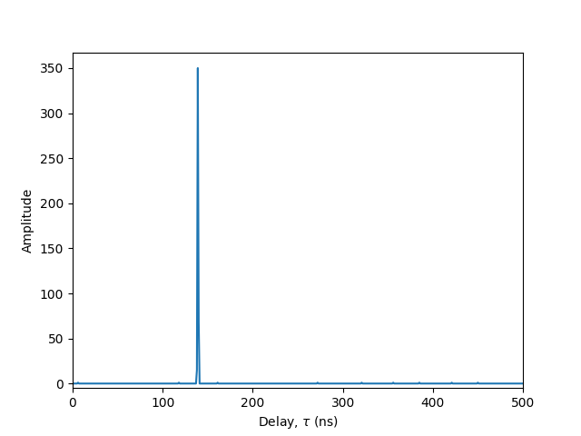

# Timestamp parser overview

The library provides the latest versions of the [timestamp parser](../../src/fpfind/lib/parse_timestamps.py) as well, which are commonly used in day-to-day lab work.

## Timestamp acquisition

Timestamp files are generally created by querying the timestamp card through a software proxy, e.g. `readevents7`.
Some sample timestamp files are available in this repository, as part of software testing. These are found under [`tests/data`](../../tests/data/).

For example, the [`tests/data/timestamp7_c14_rollover.Aa1fX.ts`](../../tests/data/timestamp7_c14_rollover.Aa1fX.ts) file can be obtained from the 4ps timestamp card with NIM FANOUT events on channel 1 and channel 4, with:

```bash
$ readevents7 -U/dev/ioboards/usbtmst0 -q1000 -A -a1 -f -X -t768 >timestamp7_c14_rollover.Aa1fX.ts
```

Note that a simplified acquisition script for continuous monitoring is available in a [separate repository](https://github.com/pyuxiang/inst-efficiency).

## Viewing timestamps

The `parse-timestamps` script creates a summary report for the timestamp file:

```bash
$ parse-timestamps -X tests/data/timestamp7_c14_rollover.Aa1fX.ts
100%|███████████████████████████████████████████████████████████████████████████████████████████████████████████████████████████████████████████████████| 1/1 [00:00<00:00, 2149.82it/s]
Name: tests/data/timestamp7_c14_rollover.Aa1fX.ts
Filesize (MB): 0.008
Total events    : 862
  Detections    : 862
  Channel 1     : 431
  Channel 2     :   0
  Channel 3     :   0
  Channel 4     : 431
  Multi-channel :   0
  No channel    :   0
Duration (s) :     0.033695816
  ~ start    : 65333.011796794
  ~ end      : 65333.045492610
Event rate (/s)  : 25581
  Detection rate : 25581
Detection patterns: [1, 8]
```

To analyze the bit contents of individual timestamps, use `show-timestamps` (binary) or `show-timestamps-hex` (hexadecimal):

```bash
$ show-timestamps tests/data/timestamp7_c14_rollover.Aa1fX.ts | head -n5
00000000: 11101101101011100001101111010111 01001100111010001000111100100001
00000008: 11101101101011100001101111010111 01001111000101000011001100001000
00000010: 11101101101011100001101111100000 11100110010111001110101100111000
00000018: 11101101101011100001101111100011 00011101111011010110011100100001
00000020: 11101101101011100001101111100011 00100000000110010001111100001000

$ show-timestamps-hex tests/data/timestamp7_c14_rollover.Aa1fX.ts | head -n5
00000000: edae1bd7 4ce88f21
00000008: edae1bd7 4f143308
00000010: edae1be0 e65ceb38
00000018: edae1be3 1ded6721
00000020: edae1be3 20191f08
```

## Post-processing timestamps

The `parse-timestamps` script can be imported as a module to do further post-processing. The sample code below performs a cross-correlation between the two channels and plots it:

```python
import matplotlib.pyplot as plt
import numpy as np

import fpfind.lib.parse_timestamps as parser
from fpfind.lib.utils import histogram_fft

# Read timestamp file (as floating-point with 1ns resolution)
ts, ps = parser.read_a1("tests/data/timestamp7_c14_rollover.Aa1fX.ts", legacy=True)

# Extract individual events
ts1 = ts[(ps & 0b0001).astype(bool)]
ts4 = ts[(ps & 0b1000).astype(bool)]

# Generate cross-correlation histogram using FFT method
N = 1_000_000  # ~2^20
ys, xs = histogram_fft(ts1, ts4, N)

# Find cross-correlation peak
i = np.argmax(ys)
yp = ys[i]
xp = xs[i]
print(xp, yp)  # 139 350.0

# Plot
plt.plot(xs, ys)
plt.xlim(0, 500)
plt.ylim(bottom=-5)
plt.ylabel("Amplitude")
plt.xlabel("Delay, $\\tau$ (ns)")
plt.show()
```


